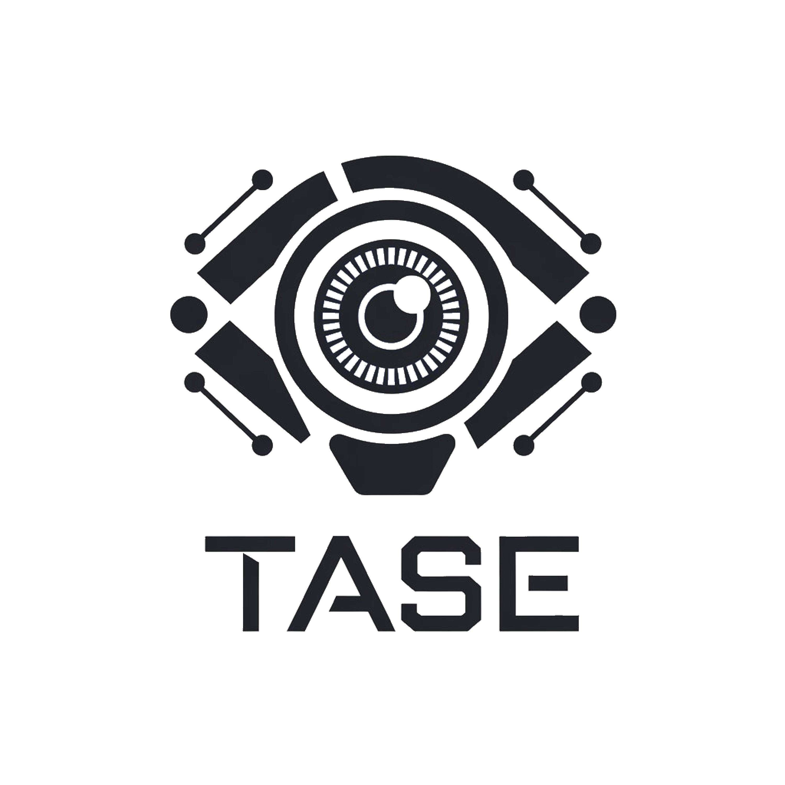

<center><center>

> [!IMPORTANT]  
> Tase is not working at the moment, being actively developed.

# Tase

Tase is a lightweight log management system written in Zig. It consists of a daemon running on a master server and lightweight agents deployed across multiple servers. With a single `config.yaml`, Tase allows centralized control over log file management, including deletion, rotation, and truncation.

## Features

- **Master-Agent Architecture**: The master server manages configurations and schedules, while agents execute log management tasks.
- **YAML-Based Configuration**: The master server reads a `config.yaml` file to determine agent behavior and scheduling.
- **Cron Scheduling**: Actions on agents are triggered based on cron expressions defined in the configuration.
- **Log File Management**: Agents support various actions on logs:
  - Delete logs older than N days
  - Rotate logs
  - Truncate logs from the bottom or top by size (MB) or lines

## Installation

Tase is written in Zig, and to build and install it, follow these steps:

```sh
# Clone the repository
git clone https://github.com/Gnyblast/tase.git
cd tase

# Build the application
zig build

# Run the master daemon
zig-out/bin/tase -m master -l info -p /var/log/tase
```

## Configuration

Tase is configured via a `config.yaml` file located on the master server. Below is an example configuration:

```yaml
---
configs:
  - app_name: "some_app"
    log_path: "/var/log/some_app"
    cron_expression: "0 4 * * *"
    run_agent_name:
      - "test"
      - "test2"
    action:
      strategy: truncate
      from: top
      by: megabytes
      size: 2048
      days_old: 2

agents:
  - name: test
    hostname: some-host-name
    port: 2000
  - name: test2
    hostname: some-host-name2
    port: 2001
```

## Usage

1. **Start the Master Daemon**: The master daemon reads the `config.yaml`, schedules jobs, and communicates with agents.
2. **Deploy Agents**: Agents run on target servers, listening for commands from the master.
3. **Manage Logs**: Logs are processed based on the defined schedules and actions.

## Roadmap

- Implement secure agent communication.
- Add support for additional log management actions.
- Provide a web interface for monitoring log management.

## License

Tase is released under the MIT License.

## Contributing

Contributions are welcome! Feel free to submit issues and pull requests on [GitHub](https://github.com/Gnyblast/tase).

## Author

Developed by [Gnyblast](https://github.com/Gnyblast).
